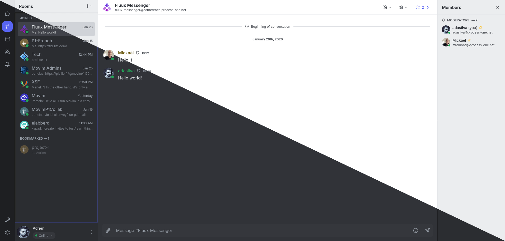

# Fluux Messenger

*A modern, cross-platform XMPP client for communities and organizations*

## 📑 Table of Contents

- [🎨 Screenshots](#-screenshots)
- [✨ Features](#-features)
- [🚀 Quick Start](#-quick-start)
- [📚 Technology Stack](#-technology-stack)
- [🆘 Support & Community](#-support-and-community)
- [🤝 Contributing](#-contributing)
- [📄 License](#-license)
- [⭐ Star History](#-star-history)

## 🎨 Screenshots

*Click on any screenshot to view full size*

| Chat Room | XMPP Console |
|-----------|--------------|
|  |  |
| *Multi-user Chat* | *XMPP Debug Interface* |

| Language Settings | Login Screen | Theme System |
|-------------------|---|-------------|
|  |  |  |
| *Currently supporting 8 languages* | *Simple Login Interface* | *Light and dark themes, more to come* |

| Admin Server Commands | Chat Rooms Management | Users Management |
|----------------------|-----------------------|------------------|
|  |  |  |
| *Manage your server right from your client* | *Moderate your rooms easily* | *User management in your client* |

## ✨ Features

- **Modern XMPP Client** - React-based UI with TypeScript
- **Cross-platform** - Available on web and desktop (Tauri-based)
- **Extensive XMPP Protocol Support** - 40+ XEPs implemented, including MAM, MUC, HTTP File Upload, message carbons, and reactions (and more to come)
- **Built-in XMPP Console** - Debug interface for developers and power users
- **Multi-user Chat** - Complete MUC support with roles, affiliations, @mentions, and bookmarks
- **File Sharing** - HTTP uploads with thumbnails, progress indicators, and previews
- **Real-time Messaging** - Typing indicators, message corrections, and delivery features
- **Offline Support** - IndexedDB storage with automatic sync on reconnect
- **Theme System** - Light/dark themes synchronized across devices
- **Self-hostable** - Connect to any XMPP server, no vendor lock-in
- **Open Source** - AGPL-3.0 licensed

## 🚀 Quick Start

### 📥 Download & Install

Download the latest release for your platform:

| Platform | Download |
|----------|----------|
| Windows (x64) | [Installer (.exe)](https://github.com/processone/fluux-messenger/releases/latest/download/Fluux.Messenger_x64-setup.exe) / [MSI (.msi)](https://github.com/processone/fluux-messenger/releases/latest/download/Fluux.Messenger_x64_en-US.msi) |
| macOS | [Intel (.dmg)](https://github.com/processone/fluux-messenger/releases/latest/download/Fluux.Messenger_x64.dmg) / [Apple Silicon (.dmg)](https://github.com/processone/fluux-messenger/releases/latest/download/Fluux.Messenger_0.11.0_aarch64.dmg) |
| Linux (x64) | [AppImage (.AppImage)](https://github.com/processone/fluux-messenger/releases/latest/download/Fluux.Messenger_amd64.AppImage) / [DEB (.deb)](https://github.com/processone/fluux-messenger/releases/latest/download/Fluux.Messenger_amd64.deb) / [RPM (.rpm)](https://github.com/processone/fluux-messenger/releases/latest/download/Fluux.Messenger-0.11.0-1.x86_64.rpm) |

*Links always point to the latest release version.*

## 📚 Technology Stack

- **Frontend**: React 18 + TypeScript
- **Desktop**: Tauri 2.x (Rust-based, lightweight)
- **Styling**: Tailwind CSS
- **State Management**: Zustand + XState
- **Build System**: Vite + Vitest
- **XMPP**: @xmpp/client + @fluux/sdk
- **Storage**: IndexedDB with idb

## 🆘 Support and Community

We welcome all questions, feedback, and bug reports!  

- **GitHub Issues** - Use [Issues](https://github.com/processone/fluux-messenger/issues) to report bugs, request features, or track tasks. Issues are preferred for anything that needs action or official tracking. We also use Issues as a lightweight roadmap for upcoming improvements.  
- **GitHub Discussions** - Use [Discussions](https://github.com/processone/fluux-messenger/discussions) for questions, ideas, or general conversations that don’t require formal tracking. Great for brainstorming or getting help without opening an Issue.  
- **XMPP Chatroom** - Join [fluux-messenger@conference.process-one.net](xmpp:fluux-messenger@conference.process-one.net?join) for live chat with the community and maintainers.

## 🤝 Contributing

Contributions are welcome! See [CONTRIBUTING](CONTRIBUTING.md) for detailed guidelines.

## 📄 License

Fluux Messenger is licensed under the **GNU Affero General Public License v3.0 or later**. See [LICENSE](LICENSE)

## ⭐ Star History

---

**Built with ❤️ by [ProcessOne](https://github.com/processone).**

